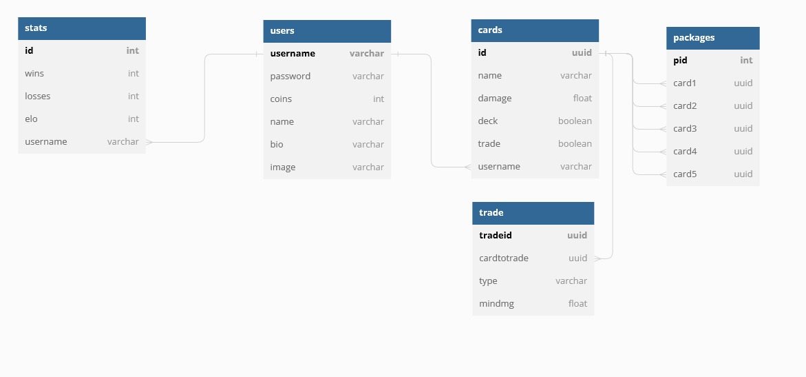

# MTCG Documentation and Learnings - Alexander Berg (needs VS 2022 (migrated to .NET 6.0))

## Link to Github

<https://github.com/Bergwiehuegel/SWEN1_MTCG>

## Mandatory Unique Feature

>My Bonus Feature is a Sudden Death Match after a playerbattle would end in a tie.
The Players battle an extra 10 rounds where the winning card gets a damage boost and the losing card gets removed.
(I also only implemented a non-permanent card change during battle by choice.)

## Lessons Learned

- Have testability in mind when writing functions/classes! (In this case especially with the DB connection/serializing of objects/etc - seperation of concern, breaking down functions, ...)
- Also think about visibility of properties in regards to testing
- HAVE A SOLID PLAN OF THE DESIGN (Patterns/Structure) - For the next project on top of the list - saves a lot of time and refactoring (which would be neccessary in this project - Some reading and practicing in the near future)
- LINQ is very useful!
- Proper Error Handling with spefic exceptions (tried that out in some places) -> also very useful
- Use models/object instances wisely/use static where appropriate - a bit wonky here

## Design

- i somewhat started with the curl script to assess the requirements (combined with the moodle pdf)
- next came the db design (based on the curl script / stats could probably be in the users table but were added later)
Database Diagram

- rudimentary class structure in Model/Controller Structure (probably faulty to some extend)

## Unit Test Design

- Battle: Testing dmg calculation functions / Special interactions between cards / changing and removing cards during battle
- CardCollection: Testing if a faulty sized Deck update generates a proper error reply / if a correct one doesn't generate the error
- Cards: Testing if a faulty sized package creation generates a proper error / if a correct one doesn't generate the error /
    if a card name gets properly parsed to Type and Element / if a faulty name throws the correct parsing error.
- User: Testing if a faulty request (empty parts) generates the proper error reply / a valid one doesn't /
    if authorization works correctly (error and no error again)
- Since I didn't think about DB connection mocking or seperation of concerns - no tests involving the DB
- Should've structured Routing a bit differently to be able to test with Moq HttpSvrEventArgs.

## Known Issues

- trade error feedback is limited
- a LOT of null reference warnings  
- the above mentioned subpar use of object oriented stuff

## Time Tracking

- 02.01. proper project start - curl script and db layout
- until 05.01. (git history starts there) first draft of working code and getting familiar with VS/C# and Postgresql
- Total hours spent: ~12 working days between 3-7 hours each. ~60 hours estimate

## Bonus thanks for the course and grace time period
